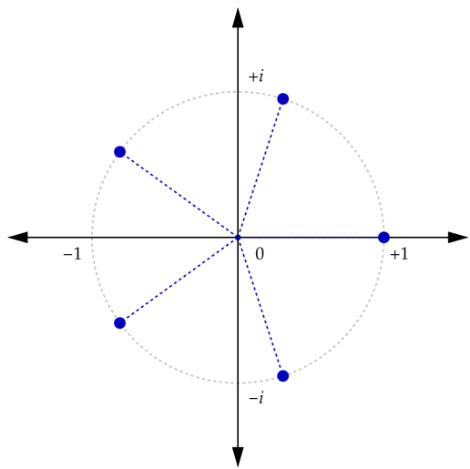

When $f\colon \mathbb{C} \to \mathbb{C}$ is a function, then that means that for every $c\in\mathbb{C}$ the value $f(c)$ is uniquely determined.
In particular, all the values $f(c), f(f(c)), \cdots f^n(c)$ are uniquely determined by $c$, so if it happens that $f^n(c)=c$, then the sequence $\{z_n\}_{n\in\mathbb{N}}$ defined by $z_{n+1}=f(z_n)$ will be periodically repeating the cycle $(f(c), f(f(c)), \cdots f^n(c)=c)$, starting from $c$.

Within the scope of complex numbers, this kind of behaviour can occur quite easily, for example when $z_0=1$ and $f(c)=c\cdot e^{i\varphi}$ with $\varphi = \frac{2\pi}{n}$, then $f^2(c)=c\cdot e^{i\cdot 2\cdot\varphi}$ and $f^n(c)=c\cdot e^{i\cdot n\cdot\varphi}=c\cdot e^{i\cdot 2\pi}=c$.
